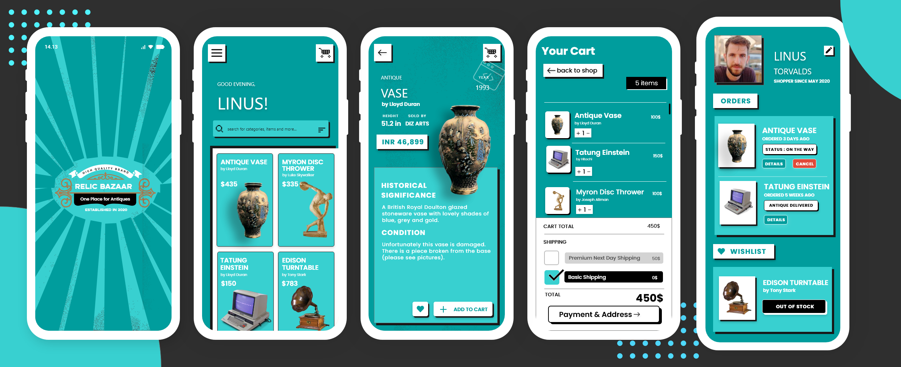

<h2 align= "left"><b>Here's some Sneak Peek🧐</b></h2>

&ensp;&ensp;&ensp;&ensp;&ensp;&ensp;&ensp;&ensp;

<h2 align= "left"><b>Our Mockup🎨</b></h2>

<h2 align= "left"><b>Tech Stack🧐</b></h2>

- Flutter
- Firebase
- Matic API
- TensorFlow + TensorFlow Lite

<h2 align= "left"><b>Contributing Guidelines</b></h2>

1. Make sure to keep the UI consistent while adding a new feature.
2. When adding new packages, use the package version which is compatible with the new flutter 2 update.
3. Make sure that your code is well documented, especially in the tougher areas.
4. Maintain a uniform naming convention throughout the codebase.
5. If your code is being repetitive then refactor it to create a new widget for future use.
6. Make the code as modular as possible, separating the UI from the logic.